

   
  
  <h1>Кроссплатформенное приложение WEB API (ASP.NET Core)</h1>

Кроссплатформенное веб-приложение с архитектурой клиент–сервер, включающее backend на базе ASP.NET Core с REST API и подключением к PostgreSQL, а также frontend на Next.js.
Приложение обеспечивает взаимодействие пользовательского интерфейса с серверной частью, обработку и хранение данных в базе данных, а также предоставляет средства аутентификации и управления пользователями.

   
   
  <h2>Демонстрация работы</h2>

https://github.com/user-attachments/assets/6156c76a-0c30-490f-8f83-79eaf2b01705

    
  <b>Главный экран</b>
    
  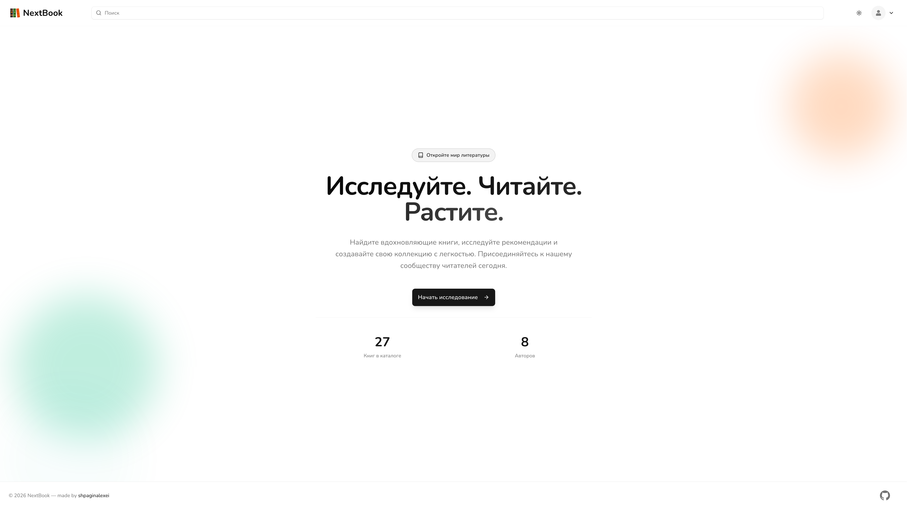
    

    
  <b>Вход / Регистрация</b>
    
  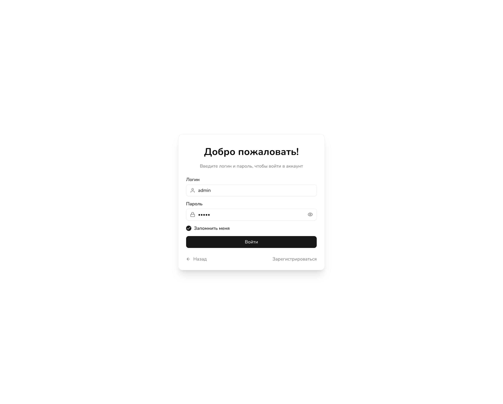
  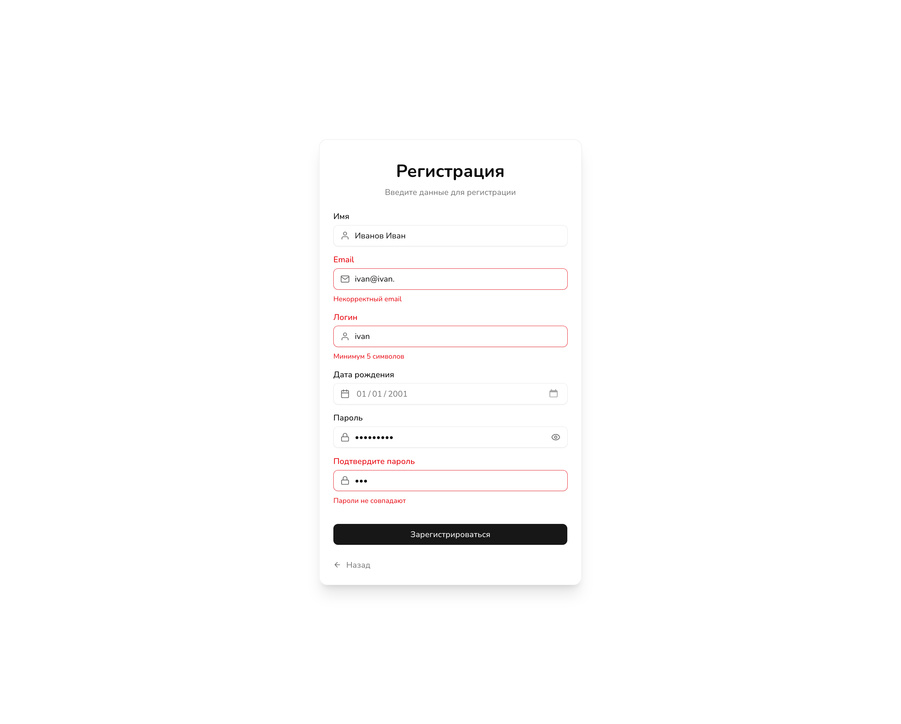
    

    
  <b>Отображение в виде таблицы / карточек</b>
    
  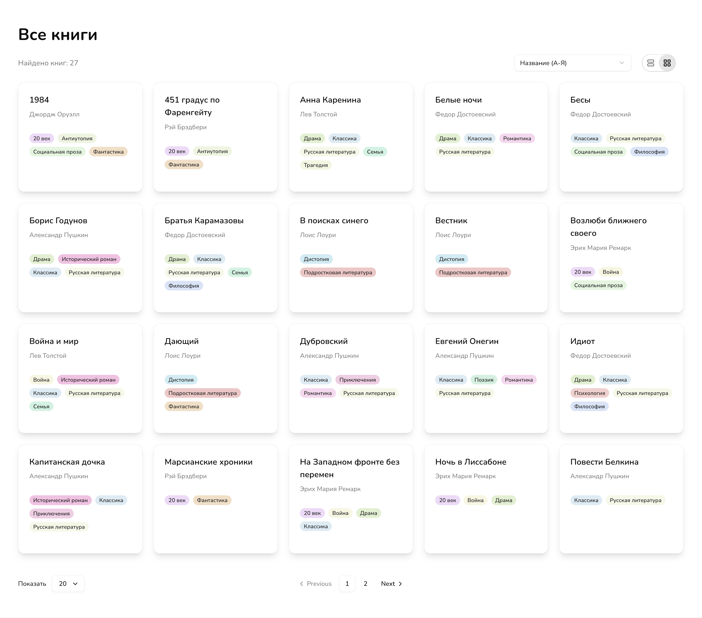
  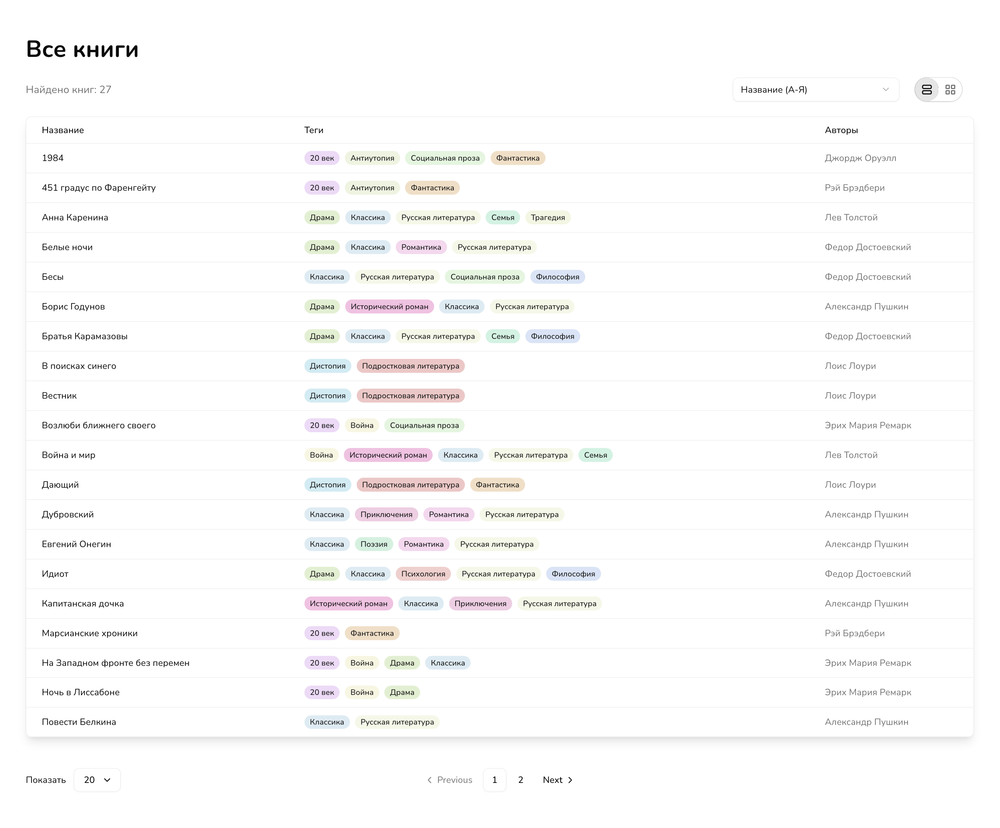
    

   
  <b>Поиск</b>
    
  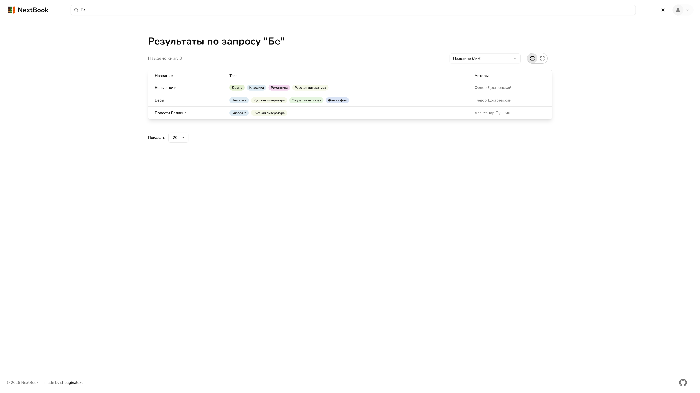
    

   
  <b>Карточка</b>
    
  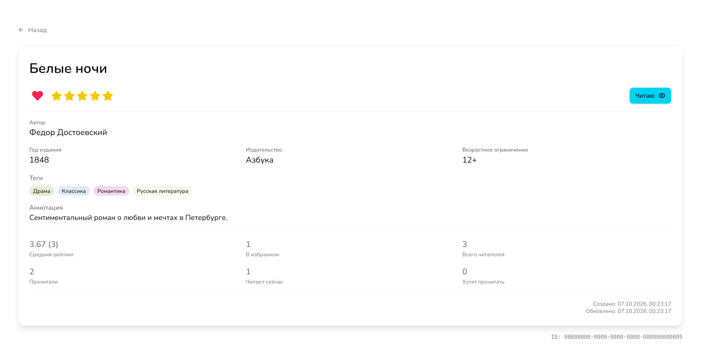
    

   
  <b>Профиль</b>
    
  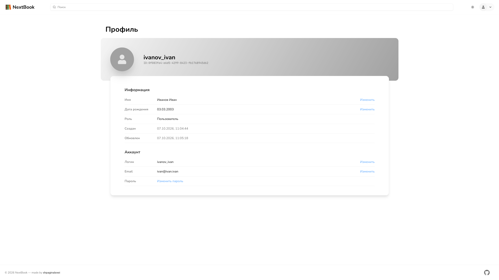
    

   
  <b>Админ-панель</b>
    
  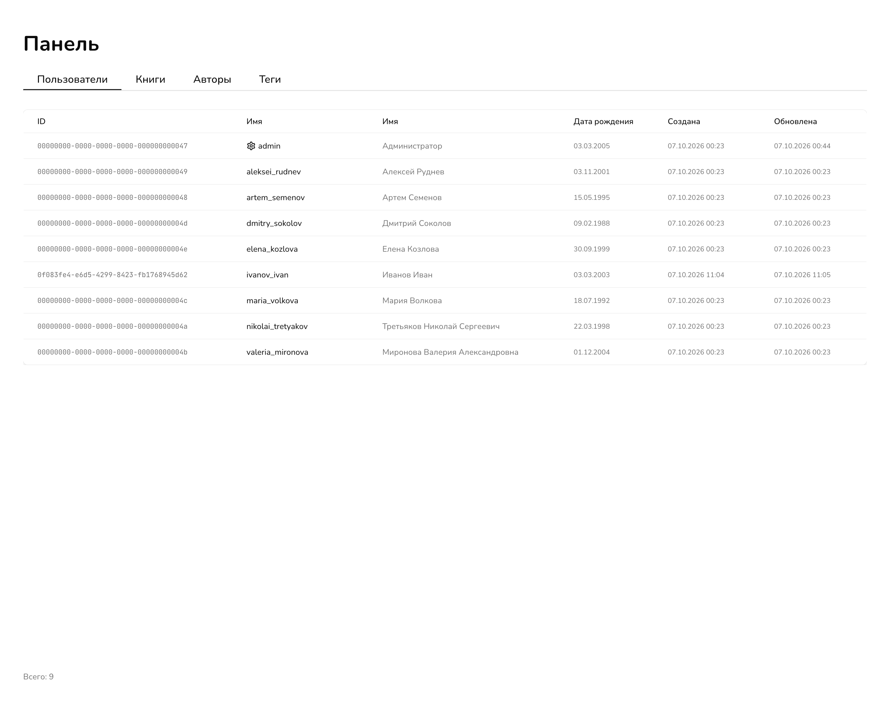
  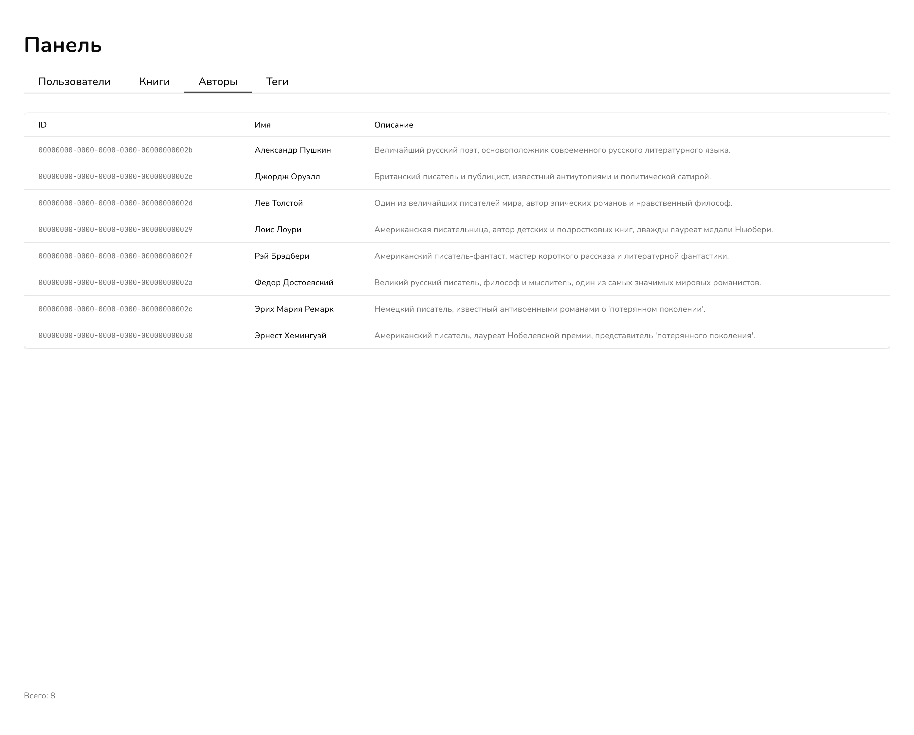
  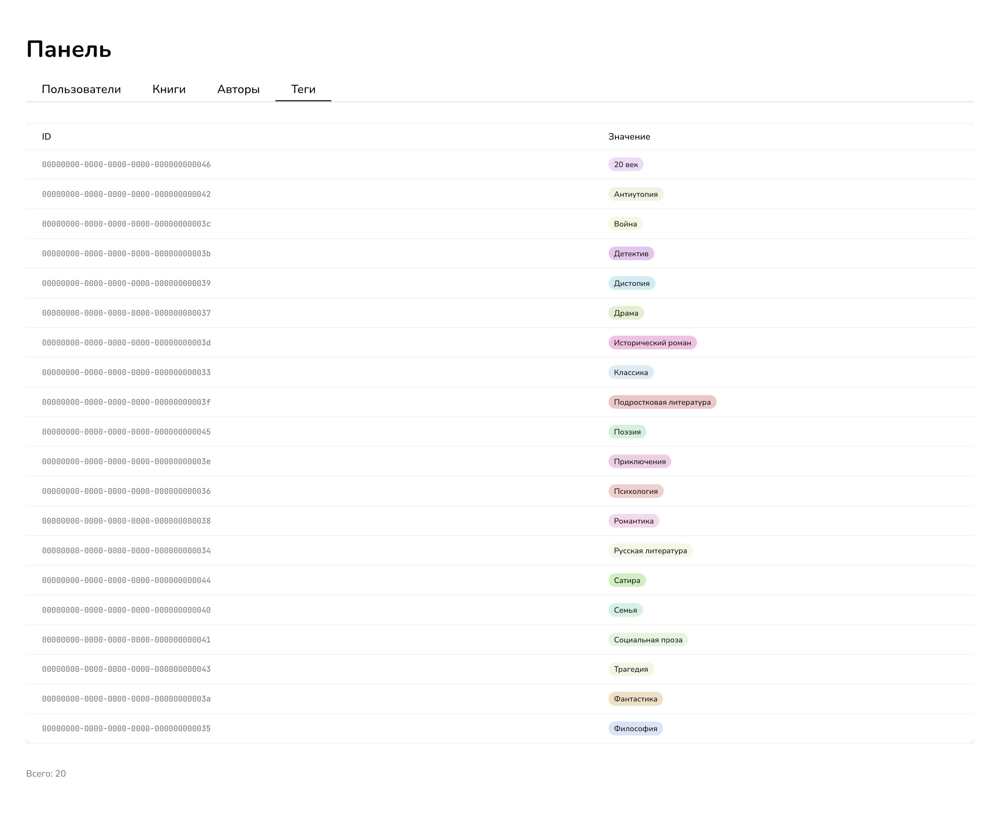
  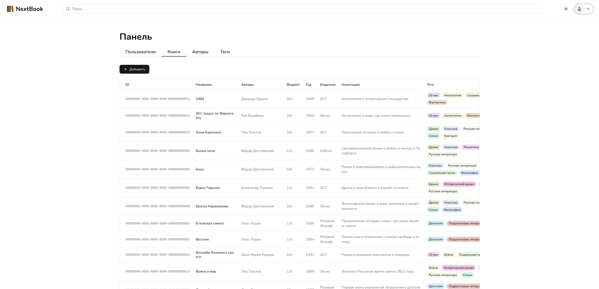
  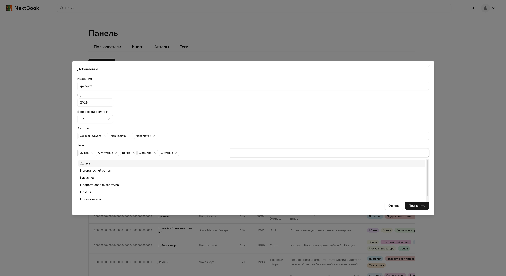
  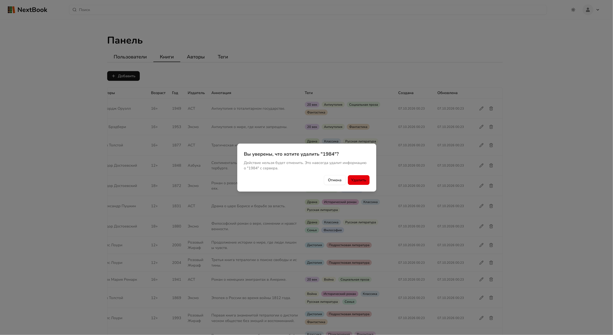
    

   
  <b>403</b>
    
  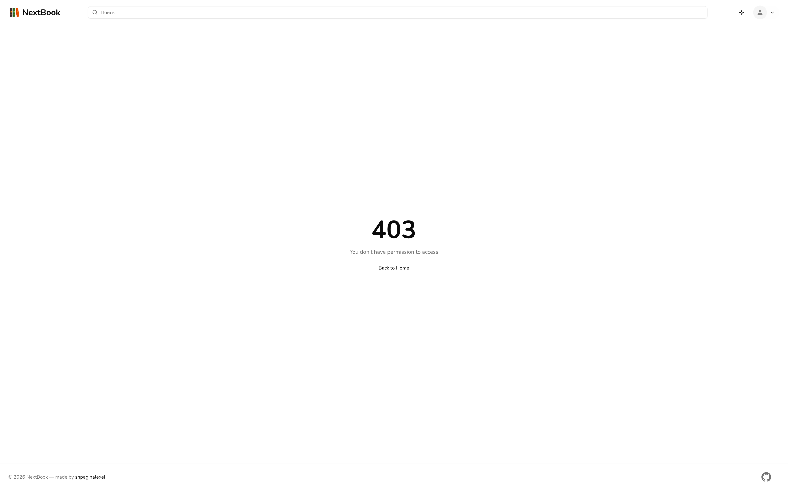
    

